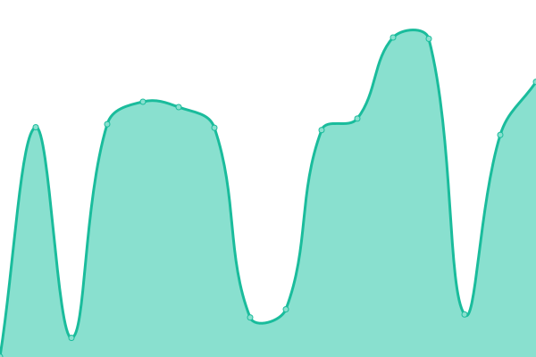
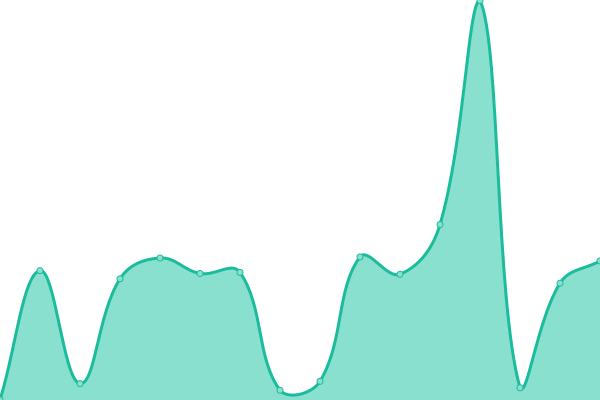

# [📈 Live Status](https://demo.upptime.js.org): <!--live status--> **🟧 Partial outage**

This repository contains the open-source uptime monitor and status page for [Samwel Waithaka](waithakasam.com), powered by [Upptime](https://github.com/upptime/upptime).

With [Upptime](https://upptime.js.org), you can get your own unlimited and free uptime monitor and status page, powered entirely by a GitHub repository. We use [Issues](https://github.com/IdrisFallout/upptime/issues) as incident reports, [Actions](https://github.com/IdrisFallout/upptime/actions) as uptime monitors, and [Pages](https://demo.upptime.js.org) for the status page.

<!--start: status pages-->
<!-- This summary is generated by Upptime (https://github.com/upptime/upptime) -->
<!-- Do not edit this manually, your changes will be overwritten -->
<!-- prettier-ignore -->
| URL | Status | History | Response Time | Uptime |
| --- | ------ | ------- | ------------- | ------ |
|  [Website](https://waithakasam.com) | 🟩 Up | [website.yml](https://github.com/IdrisFallout/upptime/commits/HEAD/history/website.yml) | 

 188ms
     
 | 

<a href="https://status.waithakasam.com/history/website">100.00%</a>
    

|  [GeminiAIChatBot](https://chat.waithakasam.com) | 🟥 Down | [gemini-ai-chat-bot.yml](https://github.com/IdrisFallout/upptime/commits/HEAD/history/gemini-ai-chat-bot.yml) | 

 1166ms
     
 | 

<a href="https://status.waithakasam.com/history/gemini-ai-chat-bot">66.65%</a>
    

|  [Swila](https://swila.waithakasam.com) | 🟥 Down | [swila.yml](https://github.com/IdrisFallout/upptime/commits/HEAD/history/swila.yml) | 

 1259ms
     
 | 

<a href="https://status.waithakasam.com/history/swila">66.46%</a>
    

<!--end: status pages-->

[**Visit our status website →**](https://demo.upptime.js.org)

## 📄 License

- Powered by: [Upptime](https://github.com/upptime/upptime)
- Code: [MIT](./LICENSE) © [Anand Chowdhary](https://anandchowdhary.com), supported by [Pabio](https://pabio.com)
- Data in the `./history` directory: [Open Database License](https://opendatacommons.org/licenses/odbl/1-0/)
